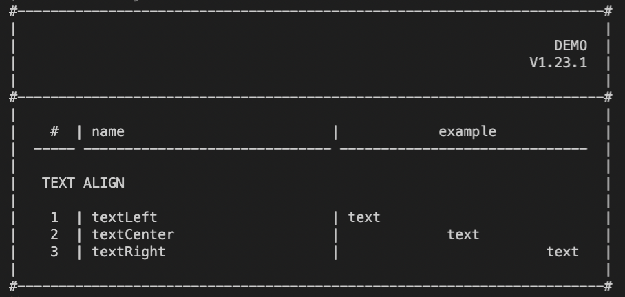

### readme: [Home](./../README.md) | [RU](./README-RU.md)

# CONSOLE-LAYOUT

> A package that contains a set of utilities that will allow you to create the basic design of your console.



## # Install

For those who use NPM:

```sh
npm install console-layout
```

For those who use YARN:

```sh
yarn add console-layout
```

## # Documentation

- [Text Align](./api/TEXT-ALIGN-EN.md)
- [Table](./api/TABLE-EN.md)
- [Card](./api/CARD-EN.md)
- [Other](./api/OTHER-EN.md) 

## # License

[MIT](./../LICENSE)
