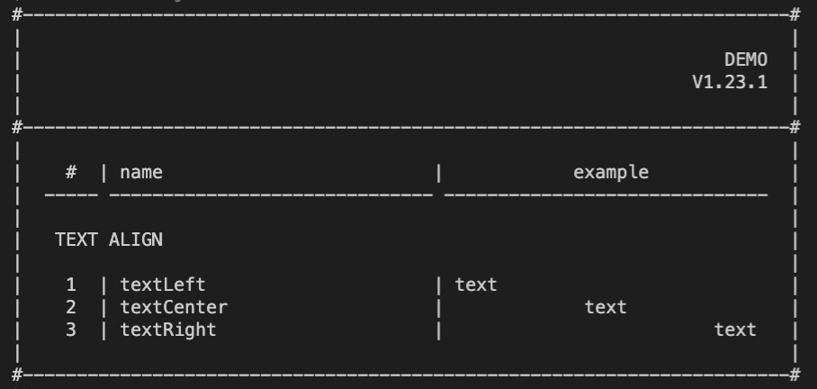

### readme: [Главная](./../README.md) | [EN](./README-EN.md)

# CONSOLE-LAYOUT

> Пакет, который содержит набор утилит, которые позволят создать основу дизайна вашей консоли.



## # Установка

Для тех кто использует NPM:

```sh
npm install console-layout
```

Для тех кто использует YARN:

```sh
yarn add console-layout
```

## # Документация

- [Положение текста](./api/TEXT-ALIGN-RU.md)
  - [textLeft](./api/TEXT-ALIGN-RU.md#-text-left)
  - [textRight](./api/TEXT-ALIGN-RU.md#-text-right)
  - [textCenter](./api/TEXT-ALIGN-RU.md#-text-center)
- [Таблица](./api/TABLE-RU.md)
  - [table](./api/TABLE-RU.md#-table)
  - [tableBorder](./api/TABLE-RU.md#-table-border)
  - [tableRow](./api/TABLE-RU.md#-table-row)
  - [tableCol](./api/TABLE-RU.md#-table-col)
- [Карточка](./api/CARD-RU.md)
  - [card](./api/CARD-RU.md#-card)
- [Прочие утилиты](./api/OTHER-RU.md)
  - [parseText](./api/OTHER-RU.md#-parse-text)
  - [rowText](./api/OTHER-RU.md#-row-text)
  - [characterSequence](./api/OTHER-RU.md#-character-sequence)
  - [line](./api/OTHER-RU.md#-line)
  - [render](./api/OTHER-RU.md#-render)

## # Лицензия

[MIT](./../LICENSE)
