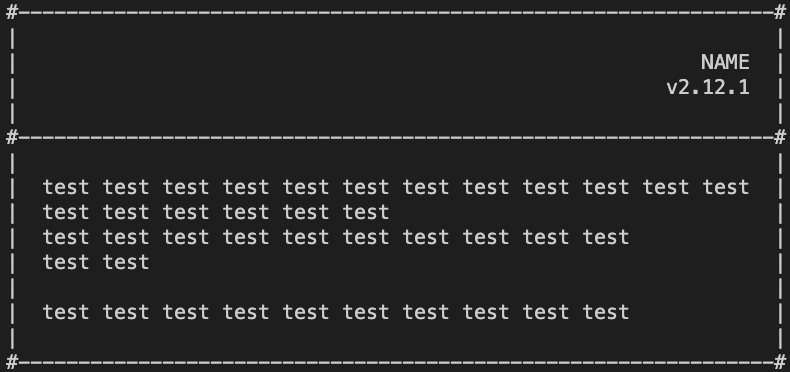

### api: [Главная](./../../README.md) | [Readme](./../README-RU.md)

# CONSOLE-LAYOUT

- [card](./CARD-RU.md#-card)

---

### # CARD

Утилита, которая позволяет отрисовать карточку с данными. Позволяет рисовать карточку без шапки.

```ts
import { card, CardTitle } from 'console-layout';

const cardContext: string[] = [
  'test test test test test test test test test test test test',
  'test test test test test test',
  'test test test test test test test test test test',
  'test test',
  '',
  'test test test test test test test test test test',
];

const cardTitle: CardTitle[] = [
  // CardTitle || CardTitle[]
  { context: 'NAME', textAlign: 'right' },
  { context: 'v2.12.1', textAlign: 'right' },
];

const context = card(cardContext, cardTitle) as string[];
console.log(context.join('\n'));
```



| Аргумент | Название | Тип                      | Обязательность | По умолчанию | Описание                                                   |
| -------- | -------- | ------------------------ | -------------- | ------------ | ---------------------------------------------------------- |
| 1        | context  | string[]                 | true           | -            | массив строк, который будет отрисовываться внутри карточки |
| 2        | title    | CardTitle \| CardTitle[] | false          | []           | данные для отрисовки заголовка карточки                    |
| 3        | options  | CardOptions              | false          | -            | опции карточки                                             |

#### тип **CardTitle**

| Ключ      | Tип                          | Обязательность | По умолчанию | Описание                     |
| --------- | ---------------------------- | -------------- | ------------ | ---------------------------- |
| context   | string \| number             | true           | -            | текст элемента               |
| textAlign | 'left'\| 'right' \| 'center' | false          | 'left'       | положение названия в колонке |

#### тип **CardOptions**

| Ключ               | Tип                 | Обязательность | По умолчанию | Описание                                               |
| ------------------ | ------------------- | -------------- | ------------ | ------------------------------------------------------ |
| borderHorizonChar  | string              | false          | '-'          | символ горизонтальной линии границы                    |
| borderVerticalChar | string              | false          | '\|'         | символ вертикальной линии границы                      |
| borderXChar        | string              | false          | '#'          | символ пересечения вертикальной и горизонтальной линий |
| typeResult         | 'string' \| 'array' | false          | 'array'      | вид возвращаемого значения: строка или массив строк    |
| hidePadding        | boolean             | false          | false        | убрать внутренний отступ                               |
| viewMargin         | boolean             | false          | false        | отобразить внешний отступ                              |

## # Документация

- [Положение текста](./TEXT-ALIGN-RU.md)
  - [textLeft](./TEXT-ALIGN-RU.md#-text-left)
  - [textRight](./TEXT-ALIGN-RU.md#-text-right)
  - [textCenter](./TEXT-ALIGN-RU.md#-text-center)
- [Таблица](./TABLE-RU.md)
  - [table](./TABLE-RU.md#-table)
  - [tableBorder](./TABLE-RU.md#-table-border)
  - [tableRow](./TABLE-RU.md#-table-row)
  - [tableCol](./TABLE-RU.md#-table-col)
- [Карточка](./CARD-RU.md)
  - [card](./CARD-RU.md#-card)
- [Прочие утилиты](./OTHER-RU.md)
  - [parseText](./OTHER-RU.md#-parse-text)
  - [rowText](./OTHER-RU.md#-row-text)
  - [characterSequence](./OTHER-RU.md#-character-sequence)
  - [line](./OTHER-RU.md#-line)
  - [render](./OTHER-RU.md#-render)
