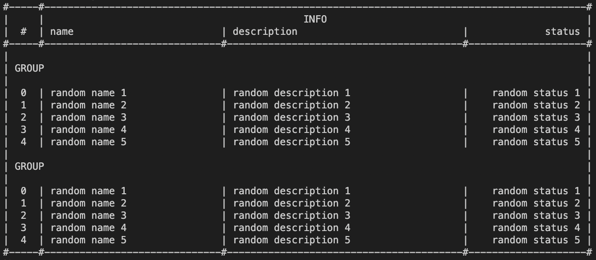

### api: [Главная](./../../README.md) | [Readme](./../README-RU.md)

# CONSOLE-LAYOUT

## # Документация

- [table](./TABLE-RU.md#-table)
- [tableBorder](./TABLE-RU.md#-table-border)
- [tableRow](./TABLE-RU.md#-table-row)
- [tableCol](./TABLE-RU.md#-table-col)

---

### # TABLE

Основная утилита, которая позволяет построить таблицу в консоли. Есть вспомогательные утилиты, которые позволят построить свой вариант таблицы. По умолчанию возвращает массив строк.

```ts
import { table, TableColumn, TableItem, TableItemGroup } from 'console-layout';

const columns: TableColumn[][] = [
  [
    { name: '', width: 5 },
    { name: 'info'.toUpperCase(), width: 92, textAlign: 'center' }, // 90 + 2 border
  ],
  [
    { name: '#', width: 5, textAlign: 'center' },
    { name: 'name', width: 30 },
    { name: 'description', width: 40 },
    { name: 'status', width: 20, textAlign: 'right' },
  ],
];

const items: TableItem[][] = [1, 2, 3, 4, 5].map((data) => [
  { context: (data - 1).toString(), textAlign: 'center' },
  { context: `random name ${data}` },
  { context: `random description ${data}` },
  { context: `random status ${data}`, textAlign: 'right' },
]);

const group: TableItemGroup[] = [{ name: 'group'.toUpperCase() }];

const contextTable = table(columns, [
  ...group,
  ...items,
  ...group,
  ...items,
]) as string[];

const context = contextTable.join('\n');
console.log(context);
```



| Аргумент | Название | Тип                              | Обязательность | По умолчанию | Описание                                                                           |
| -------- | -------- | -------------------------------- | -------------- | ------------ | ---------------------------------------------------------------------------------- |
| 1        | columns  | TableColumn[][]                  | true           | -            | двухмерный массив с опциями колонок таблицы                                        |
| 2        | items    | TableItem[][] & TableItemGroup[] | true           | -            | список элементов для таблицы(может содержать элементы даты, так и элементы группы) |
| 3        | options  | TableOptions                     | false          | -            | дополнительные параметры для таблицы                                               |

#### тип **TableColumn**

| Ключ      | Tип                           | Обязательность | По умолчанию | Описание                     |
| --------- | ----------------------------- | -------------- | ------------ | ---------------------------- |
| name      | string                        | true           | -            | название колонки             |
| width     | number                        | true           | -            | ширина колонки               |
| textAlign | 'left' \| 'right' \| 'center' | false          | 'left'       | положение названия в колонке |

#### тип **TableItem**

| Ключ      | Tип                           | Обязательность | По умолчанию | Описание                   |
| --------- | ----------------------------- | -------------- | ------------ | -------------------------- |
| context   | string \| number              | true           | -            | текст элемента             |
| textAlign | 'left' \| 'right' \| 'center' | false          | 'left'       | положение текста в колонке |

#### тип **TableItemGroup**

| Ключ      | Tип                           | Обязательность | По умолчанию | Описание                  |
| --------- | ----------------------------- | -------------- | ------------ | ------------------------- |
| name      | string \| number              | true           | -            | текст группы              |
| textAlign | 'left' \| 'right' \| 'center' | false          | 'left'       | положение названия группы |

#### тип **TableOptions**

| Ключ                    | Tип                 | Обязательность | По умолчанию | Описание                                               |
| ----------------------- | ------------------- | -------------- | ------------ | ------------------------------------------------------ |
| borderHorizonChar       | string              | false          | '-'          | символ горизонтальной линии границы                    |
| borderVerticalChar      | string              | false          | '\|'         | символ вертикальной линии границы                      |
| borderXChar             | string              | false          | '#'          | символ пересечения вертикальной и горизонтальной линий |
| typeResult              | 'string' \| 'array' | false          | 'array'      | вид возвращаемого значения: строка или массив строк    |
| hideOuterBorderHorizon  | boolean             | false          | false        | убрать горизонтальную линию                            |
| hideOuterBorderVertical | boolean             | false          | false        | убрать вертикальную линию                              |

### # TABLE-BORDER

Дополнительная утилита таблицы, которая позволяет сформировать бордер для таблицы.

```ts
import { tableBorder } from 'console-layout';

const context0 = tableBorder([8]);
console.log(context0); // #--------#

const context1 = tableBorder([8], { char: '*', xChar: 'X' });
console.log(context1); // X********X

const context2 = tableBorder([8], { xChar: 'X', hideOuterXChar: true });
console.log(context2); // --------

const context3 = tableBorder([2, 4, 6]);
console.log(context3); // #--#----#------#
```

| Аргумент | Название | Тип                | Обязательность | По умолчанию | Описание        |
| -------- | -------- | ------------------ | -------------- | ------------ | --------------- |
| 1        | width    | number[]           | true           | -            | массив отрезков |
| 2        | options  | TableBorderOptions | false          | -            | опции утилиты   |

#### тип **TableBorderOptions**

| Ключ            | Tип     | Обязательность | По умолчанию | Описание                                      |
| --------------- | ------- | -------------- | ------------ | --------------------------------------------- |
| char            | string  | false          | '-'          | символ, который надо отрисовать               |
| xChar           | string  | false          | '#'          | символ, который располагается между отрезков  |
| hideOuterBorder | boolean | false          | false        | скрыть внешние символы границ колонок         |

### # TABLE-ROW

Дополнительная утилита таблицы, которая позволяет сформировать ряд колонок для таблицы.

```ts
import { tableRow, TableRowColumn } from 'console-layout';

const columns: TableRowColumn[] = [
  { context: 'random text 1', width: 30 },
  { context: 'random status 1', width: 30, textAlign: 'right' },
];

const context0 = tableRow(columns);
console.log(context0); // | random text 1                |              random status 1 |

const context1 = tableRow(columns, { borderChar: 'X' });
console.log(context1); // X random text 1                X              random status 1 X

const context2 = tableRow(columns, { hideOuterBorder: true });
console.log(context2); //  random text 1                |              random status 1

const context3 = tableRow(columns, { hideOuterBorder: true, borderChar: 'X' });
console.log(context3); //  random text 1                X              random status 1
```

| Аргумент | Название | Тип              | Обязательность | По умолчанию | Описание       |
| -------- | -------- | ---------------- | -------------- | ------------ | -------------- |
| 1        | columns  | TableRowColumn[] | true           | -            | массив колонок |
| 2        | options  | TableRowOptions  | false          | -            | опции утилиты  |

#### тип **TableRowColumn**

| Ключ      | Tип                           | Обязательность | По умолчанию | Описание                         |
| --------- | ----------------------------- | -------------- | ------------ | -------------------------------- |
| context   | string \| number              | true           | -            | содержимое колонки               |
| width     | number                        | true           | -            | ширина колонки в кол-ве символов |
| textAlign | 'left' \| 'right' \| 'center' | false          | 'left'       | положение текста в колонке       |

#### тип **TableRowOptions**

| Ключ            | Tип     | Обязательность | По умолчанию | Описание                              |
| --------------- | ------- | -------------- | ------------ | ------------------------------------- |
| borderChar      | string  | false          | '\|'         | cимвол границ колонок                 |
| hideOuterBorder | boolean | false          | false        | скрыть внешние символы границ колонок |

### # TABLE-COL

Дополнительная утилита таблицы, которая позволяет сформировать данные для колонки таблицы. Надо иметь ввиду, что не задает внешние границы.

```ts
import { tableCol } from 'console-layout';

const context = [
  '',
  tableCol('text', 10),
  tableCol('text', 10, 'center'),
  tableCol('text', 10, 'right'),
  '',
].join('|');

console.log(context); // | text     |   text   |     text |
```

| Аргумент | Название  | Тип                           | Обязательность | По умолчанию | Описание                   |
| -------- | --------- | ----------------------------- | -------------- | ------------ | -------------------------- |
| 1        | context   | string \| number              | true           | -            | содержимое колонки         |
| 2        | width     | number                        | true           | -            | ширина колонки             |
| 3        | textAlign | 'left' \| 'right' \| 'center' | false          | 'left'       | положение текста в колонке |

## # Документация

- [Положение текста](./TEXT-ALIGN-RU.md)
  - [textLeft](./TEXT-ALIGN-RU.md#-text-left)
  - [textRight](./TEXT-ALIGN-RU.md#-text-right)
  - [textCenter](./TEXT-ALIGN-RU.md#-text-center)
- [Таблица](./TABLE-RU.md)
  - [table](./TABLE-RU.md#-table)
  - [tableBorder](./TABLE-RU.md#-table-border)
  - [tableRow](./TABLE-RU.md#-table-row)
  - [tableCol](./TABLE-RU.md#-table-col)
- [Карточка](./CARD-RU.md)
  - [card](./CARD-RU.md#-card)
- [Прочие утилиты](./OTHER-RU.md)
  - [parseText](./OTHER-RU.md#-parse-text)
  - [rowText](./OTHER-RU.md#-row-text)
  - [characterSequence](./OTHER-RU.md#-character-sequence)
  - [line](./OTHER-RU.md#-line)
  - [render](./OTHER-RU.md#-render)
